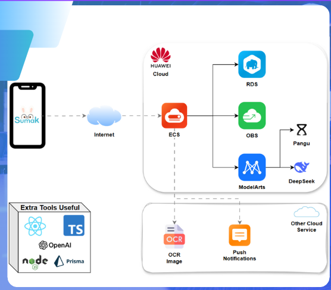

# 🌱 Sumak - AI-Powered Personalized Education Platform

> **Sumak** (Quechua for "beautiful" or "good") is revolutionizing education in Latin America through AI-powered personalized learning experiences.

## 🚀 Mission

Sumak transforms traditional educational content into interactive, AI-enhanced learning experiences. Our platform empowers teachers to easily digitize their notes and materials, while providing students with personalized AI tutors and adaptive learning tools.

### 🎯 Key Features

- **📝 Intelligent Content Processing**: Upload handwritten notes or images, and our AI transforms them into structured, readable content
- **🤖 AI Tutor**: Context-aware chatbot that answers questions based specifically on course materials
- **📊 Interactive Quizzes**: Auto-generated practice questions tailored to each topic
- **👩‍🏫 Teacher Dashboard**: Manage classes, topics, and monitor student engagement
- **👨‍🎓 Student Experience**: Join classes, access organized content, and learn with AI assistance

## 🎬 Demo

Check out Sumak in action:

https://github.com/sergiolozav2/Sumak/raw/main/docs/demo/demo1.mp4

_[Demo video showcasing the complete teacher-to-student workflow]_

## 🏗️ Infrastructure & Technology

Sumak is built on a robust, scalable architecture powered by **Huawei Cloud Services**:



### Cloud Services Stack

- **🖥️ Huawei ECS (Elastic Cloud Server)**: Application hosting and compute resources
- **🧠 ModelArts**: AI/ML model training and inference with DeepSeek integration
- **🗄️ RDS (Relational Database Service)**: PostgreSQL database for reliable data storage
- **☁️ Additional Huawei Cloud Services**: For storage, CDN, and other cloud-native features

### Technology Stack

- **Frontend**: React 19 with TypeScript
- **Routing**: TanStack Router (file-based routing)
- **State Management**: TanStack Query for server state
- **API**: tRPC for type-safe client-server communication
- **Styling**: Tailwind CSS + daisyUI components
- **Database**: PostgreSQL with Prisma ORM
- **Build Tool**: Vite
- **Testing**: Vitest
- **AI/ML**: DeepSeek models via Huawei ModelArts

## 🚀 Quick Start

### Prerequisites

Make sure you have [pnpm](https://pnpm.io/) installed:

```bash
npm install -g pnpm
```

### Installation & Setup

1. **Clone the repository**

```bash
git clone https://github.com/your-org/sumak-landing.git
cd sumak-landing
```

2. **Install dependencies**

```bash
pnpm install
```

3. **Generate database client**

```bash
npm run db-gen
```

4. **Start the development server**

```bash
pnpm run dev
```

The application will be available at `http://localhost:3000`

## 🛠️ Development

### Available Scripts

```bash
# Development
pnpm dev              # Start dev server on port 3000
pnpm build            # Build for production
pnpm serve            # Preview production build

# Database
npm run db-gen        # Generate Prisma client
npm run db-migrate    # Run database migrations

# Code Quality
pnpm test             # Run tests with Vitest
pnpm lint             # Lint code with ESLint
pnpm format           # Format code with Prettier
pnpm check            # Run linting and formatting
```

### Project Structure

```
src/
├── routes/                 # File-based routing
│   ├── admin-teacher/     # Teacher dashboard & tools
│   ├── admin-student/     # Student learning interface
│   └── api.trpc.$.tsx     # tRPC API endpoints
├── components/            # Reusable UI components
├── integrations/          # External service integrations
│   ├── trpc/             # API layer with tRPC
│   ├── prisma/           # Database layer
│   └── services/         # AI & business logic services
└── utils/                # Utility functions
```

## 🎓 User Journey

### For Teachers

1. **Create Account** → Choose "Teacher" role
2. **Create Class** → Generate unique join code
3. **Add Topics** → Upload notes or type content
4. **AI Processing** → Content is structured and enhanced
5. **Monitor** → View student engagement and progress

### For Students

1. **Create Account** → Choose "Student" role
2. **Join Class** → Enter teacher's class code
3. **Browse Topics** → Access organized course materials
4. **Learn** → Read AI-enhanced notes
5. **Practice** → Generate quizzes and chat with AI tutor

## 🌟 What Makes Sumak Special

- **🎯 Context-Aware AI**: Our AI tutor only answers based on the specific course content, preventing academic dishonesty while providing focused help
- **📱 Mobile-First Design**: Responsive interface optimized for Latin American mobile usage patterns
- **🔒 Privacy-Focused**: Student data and conversations remain within the educational context
- **⚡ Real-time Processing**: Fast OCR and AI processing for immediate content transformation
- **🌐 Localized**: Built with Latin American educational needs in mind

## 🤝 Contributing

We welcome contributions! Please see our [Contributing Guidelines](CONTRIBUTING.md) for details.

## 📄 License

This project is licensed under the MIT License - see the [LICENSE](LICENSE) file for details.

## 🌎 About Sumak

Sumak is on a mission to democratize quality education across Latin America by making AI-powered personalized learning accessible to every teacher and student. Join us in transforming education, one classroom at a time.

---

**Built with ❤️ for educators in Latin America**
